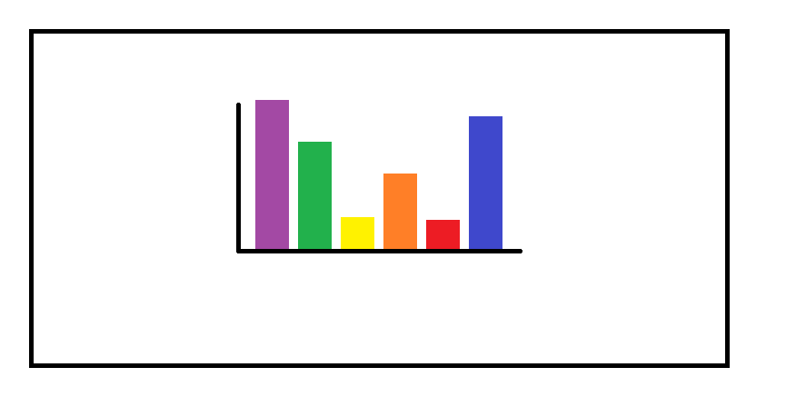

```{r setup, include=FALSE}
## **DO NOT EDIT THIS CODE CHUNK**
knitr::opts_chunk$set(echo = TRUE)
library(tidyverse)
```

```{r}
strava_runs <- read_csv("data/strava_runs.csv")
```

```{r}
data_5k_10k <- strava_runs %>%
  mutate(
    event = case_when(
      distance..m. > 4998 & distance..m. < 5015  ~ "5k",
      distance..m. > 9998 & distance..m. < 10015 ~ "10k",
      TRUE ~ NA_character_
    )
  ) %>%
  filter(!is.na(event))
```


## Exercise 1

```{r ex1a, out.width="80%"}
data_5k_10k %>% 
  filter(gender == "M") %>%
  filter(!is.na(average.heart.rate..bpm.)) %>%
  ggplot(aes(x = average.heart.rate..bpm.)) + 
  geom_histogram(bins = 20)

male_summarise <- data_5k_10k %>% 
  filter(gender =="M") %>%
  filter(!is.na(average.heart.rate..bpm.)) %>%
  summarise(
    mean_hr = mean(average.heart.rate..bpm.),
    var_hr = var(average.heart.rate..bpm.),
    sd_hr = sd(average.heart.rate..bpm.),
    Min_hr = min(average.heart.rate..bpm.),
    Max_hr = max(average.heart.rate..bpm.)
  )
male_summarise
```


_Write your text to answer exercise 1a here (Please delete this message before submission!)_
The distribution is right-skewed (positively skewed). As the heart rate increases, the frequency gradually decreases.unimodal distribution. Most runners have a low heart rate, with a minority having a higher rate.

```{r ex1b, out.width="80%"}
# Write your code for Ex1b here
data_5k_10k %>% 
  filter(gender == "F") %>%
  filter(!is.na(average.heart.rate..bpm.)) %>%
  ggplot(aes(x = average.heart.rate..bpm.)) + 
  geom_histogram(bins = 20)


```


#Write your text to answer exercise 1b here (Please delete this message before submission!)_
The average heart rate distribution for this group of runners is an approximately normal, unimodal, and symmetric distribution.
Both datasets have only one distinct peak. But distribution Shape (Skewness) is the most critical difference.Not only is the central value of the average heart rate higher in the female group, but its distribution shape is also fundamentally different from the right-skewed male distribution, exhibiting symmetry.

## Exercise 2

```{r ex2, out.width = "80%"}
# Write your code to answer exercise 2a here

library(tidyverse)

strava_runs <- read_csv("data/strava_runs.csv")

data_5k_10k <- strava_runs %>%
  mutate(
    event = case_when(
      `distance..m.` > 4998 & `distance..m.` < 5015  ~ "5k",
      `distance..m.` > 9998 & `distance..m.` < 10015 ~ "10k",
      TRUE ~ NA_character_
    )
  ) %>%
  filter(!is.na(event))

data_5k_10k <- data_5k_10k %>%
  mutate(
    pace = `elapsed.time..s.` / 60 / (`distance..m.` / 1000)
  )

ggplot(data = data_5k_10k, aes(x = event, y = pace)) +
  geom_boxplot(fill = "skyblue", color = "darkblue", alpha = 0.6) +
  facet_wrap(~ gender) +
  labs(
    title = "Distribution of Running Pace for 5K and 10K Runs by Gender",
    subtitle = "Pace measured in minutes per kilometer",
    x = "Run Type",
    y = "Pace (min/km)"
  ) +
  theme_minimal(base_size = 14) +
  theme(
    plot.title = element_text(face = "bold", hjust = 0.5),
    plot.subtitle = element_text(hjust = 0.5),
    strip.text = element_text(face = "bold"),
    axis.title = element_text(face = "bold")
  )

#Write your text to answer exercise 2b here (Please delete this message before submission!)_
#Runners generally have faster paces in 5K runs compared to 10K runs, and male runners tend to have slightly faster median paces than female runners. Additionally, pace variation is larger in 10K runs, indicating more differences in endurance over longer distances.


## Exercise 3

#```{r ex3, out.width = "80%"}
# Write your code to answer exercise 3 here

library(ggplot2)
library(dplyr)
library(readr)

strava_runs <- read_csv("data/strava_runs.csv")

possible_time_cols <- c("elapsed.time..s.", "elapsed_time", "moving_time", "duration", "total_elapsed_time", "time")
time_col <- NULL

for (col in possible_time_cols) {
  if (col %in% names(strava_runs)) {
    time_col <- col
    break
  }
}

if (is.null(time_col)) {
  
  numeric_cols <- names(strava_runs)[sapply(strava_runs, is.numeric)]
  print("Available numeric columns (potential time columns):")
  print(numeric_cols)
  stop("Please identify which column contains elapsed time in seconds from the list above.")
} else {
  print(paste("Using time column:", time_col))
}

runner_avg_distance <- strava_runs %>%
  group_by(athlete) %>%
  summarise(avg_distance_km = mean(distance..m. / 1000, na.rm = TRUE)) %>%
  mutate(runner_type = case_when(
    avg_distance_km > 13 ~ "Long-distance runner",
    avg_distance_km < 7 ~ "Short-distance runner",
    TRUE ~ NA_character_
  ))

strava_filtered <- strava_runs %>%
  inner_join(runner_avg_distance, by = "athlete") %>%
  filter(!is.na(runner_type)) %>%
  mutate(
    distance_km = distance..m. / 1000,
    speed_m_s = distance..m. / .data[[time_col]]  # Use the identified time column
  )

ggplot(data = strava_filtered, 
       aes(x = distance_km, y = speed_m_s, color = runner_type)) +
  geom_point(alpha = 0.6, size = 1.5) +
  scale_color_manual(values = c("Long-distance runner" = "forestgreen", 
                               "Short-distance runner" = "orange")) +
  labs(
    title = "Speed vs Distance for Long- and Short-Distance Runners",
    subtitle = "Grouped by runners' average distance: >13 km vs <7 km",
    x = "Distance (km)",
    y = "Run average speed (m/s)",
    color = "Runner Type"
  ) +
  theme_minimal() +
  theme(
    legend.position = "bottom",
    plot.title = element_text(face = "bold", size = 14),
    plot.subtitle = element_text(size = 12)
  )
  


## Exercise 4

#### Example of a good data visualisation

#{r ex4_good_viz, echo = FALSE, out.width = "80%"}
# edit the file path accordingly
knitr::include_graphics("img/good_viz.png")
```

_Edit the text below by replacing the bold text with the appropriate information to provide a reference for your image (Please delete this message before submission!)_

**Author/Organisation**, "**Title of website**" [Online]. Available at: **URL** (Accessed: **day month year**)


The above image presents a good data visualisation because:

-   _Reason 1_
-   _Reason 2_


#### Example of a bad data visualisation


```{r ex4_bad_viz, echo = FALSE, out.width = "80%"}
# edit the file path accordingly

```

_Edit the text below by replacing the bold text with the appropriate information to provide a reference for your image (Please delete this message before submission!)_

**Author/Organisation**, "**Title of website**" [Online]. Available at: **URL** (Accessed: **day month year**)


The above image presents a bad data visualisation because:

-   _Reason 1_
-   _Reason 2_


